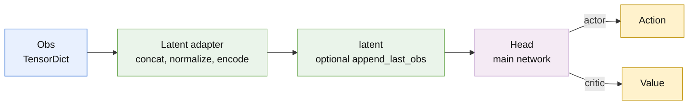
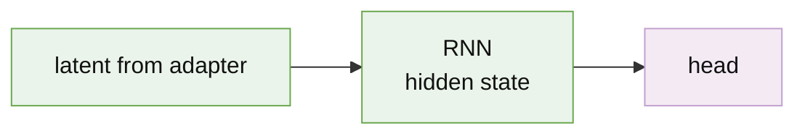
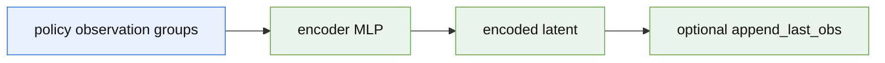
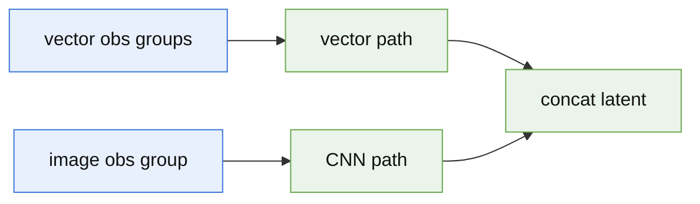
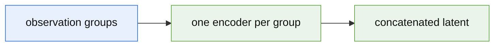
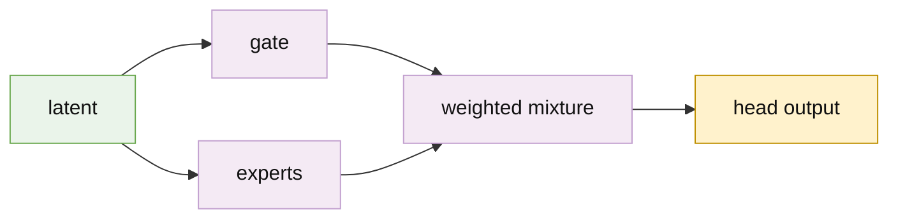

# Models

Runtime: `obs TensorDict -> latent adapter -> (RNN) -> head -> (distribution) -> output`.

- `mlp_model.py`: `MLPModel` — concat 1D groups, optional normalize, MLP head.
- `composition/`: `LatentSpec` / `HeadSpec`, `ComposableModel`, adapters.
- `variants/`: named presets. A spec that only serves one preset lives next to it. Specs are re-exported from `z_rl.models` so `class_name` lookup works; `variants/__init__.py` only exports model classes.

`ZRlMLPModelCfg.layer_norm` accepts `None`, `"pre_activation"`, or `"post_activation"`. It applies to each hidden
layer of the default MLP head, including when a model uses a custom latent spec. It does not affect custom heads or
encoder MLPs.

## Composition Data Flow

Every actor and critic model follows the same composition pipeline. The active observation set selects the groups used
by that model; a latent adapter turns the structured `TensorDict` into a latent; an optional recurrent layer transforms
that latent; and a head produces the model output. Actor models can then pass head parameters through a distribution to
produce sampled or deterministic actions. The diagram nodes link to their implementation files when viewed on GitHub.



The `actor` and `critic` use separate model instances, so they may choose different observation groups, latent specs,
heads, and normalization settings. `Distribution` is normally present for an actor and omitted for a critic. Variant
specific transformations are shown in their sections below.

## Variants

| Preset | Role | Spec |
| --- | --- | --- |
| `RNNModel` | RNN between adapter and head | none; kwargs `rnn_type`, `rnn_hidden_dim`, `rnn_num_layers` |
| `MLPEncoderModel` | MLP encoder latent | `MLPEncoderLatentSpec` |
| `GroupMLPEncoderModel` | Per-group MLP latent | `GroupMLPLatentSpec` |
| `CNNModel` | CNN latent | `CNNLatentSpec` |
| `MoEModel` | MoE head | `MoEHeadSpec` |

Preset kwargs that match spec fields are bound onto the spec. Specs also work on `ComposableModel` / `RNNModel` without the named preset.

### RNNModel



RNN input width is the adapter output; the head consumes `rnn_hidden_dim`. ONNX is vector-obs only (`obs`, `h_in`, `c_in`) — extra tensors such as a CNN image are not packed.

### MLPEncoderModel



Optional `append_last_obs` appends the last frame of `append_obs_group` (default `policy`, from `obs_group_time_slice_map`) after the encoder.

### CNNModel



One 2D group (`image_obs_group`) through a CNN; remaining groups must be 1D. Each group is normalized/encoded, then concatenated. No multi-2D groups, no actor/critic CNN sharing.

ONNX: 1D groups packed as `obs`, image stays at native rank.

`CNNLatentSpec`: `image_obs_group`, `cnn_cfg` (flattened CNN output required), `cnn_projection_cfg`, `append_last_obs`, `append_obs_group` (default `policy`).

### GroupMLPEncoderModel



`GroupMLPLatentSpec` encodes every active 1D observation group independently. Each entry in `encoder_cfgs` requires
`output_dim` and optionally accepts `hidden_dims`, `activation`, `layer_norm`, and `obs_normalization`. Different groups
may use different output widths. Model-level `obs_normalization` applies to every group that omits the key. A group entry may
set `obs_normalization` to `False`, `True`, or an `EmpiricalNormalization` dict (`decay`, `stats_shape`, `eps`, `until`)
to override that group. Each enabled group keeps its own running statistics. Per-group `layer_norm` accepts
`"pre_activation"` or `"post_activation"` for encoder hidden layers; it is independent of the model-level MLP head setting.
`append_last_obs` appends the last frame of `append_obs_group` (default `policy`, from `obs_group_time_slice_map`) after the encoded groups.

### MoEModel



Dense MoE (`top_k=None`): every expert runs and the gate mixes. Sparse routing can limit execution with `top_k`.
Pair with `MoEPPO`.

`MoEHeadSpec`: `num_experts`, `expert_hidden_dims`, `gate_hidden_dims` (`None` = linear gate), and optional `top_k`.
With `top_k` set, only the selected experts run per sample; `None` keeps dense routing.

`MoERoutingLossSpec`: `expert_balance_loss` (KL to uniform, default `1e-4`), `gate_entropy_loss` (default `0`). At least one of actor/critic must have an MoE head.

Pretrained experts load into `head.experts` only, never the gate. Use `pretrained_expert_path` **or** `pretrained_expert_specs`. Checkpoints may be a raw `state_dict` or wrapped under `actor_state_dict` / `state_dict`. MoE keys (`head.experts.weights.0`) and MLP heads (`head.0.weight`) are both accepted; MLP weights are transposed into the stacked `[E, in, out]` layout.

## Specs

```python
from z_rl.models import ComposableModel, MLPEncoderLatentSpec, MoEHeadSpec

model = ComposableModel(
    ...,
    latent_spec=MLPEncoderLatentSpec(encoder_latent_dim=128),
    head_spec=MoEHeadSpec(num_experts=4),
)
```

Config form: `{"class_name": "MLPEncoderLatentSpec", ...}`. `RNNModel` can take `CNNLatentSpec` / `MoEHeadSpec` the same way.

- `LatentSpec`: `build(model)`, `get_latent_dim(model)`; optional `validate`. Omit to keep `model.obs_dim`.
- `HeadSpec`: `build(model, input_dim, output_dim, activation)`.
- `ObsLatentAdapter`: concat → normalize → encode. `GroupObsLatentAdapter`: per-group then concat. Runtime `forward(obs: TensorDict)`. Implement `as_export_module()` for ONNX.

## Export

Entry point: `model.as_onnx(...)`. Training adapters take a `TensorDict`; export uses `as_export_module()` on a flat tensor. Non-vector ONNX inputs also need `export_dummy_inputs()` and `export_input_names()`.

## Maintenance

Keep runtime and export aligned. Normalization stays on the adapter that consumes those observations. Contract changes: this README and `z_rl/cli/plugin_templates/models.py`.
